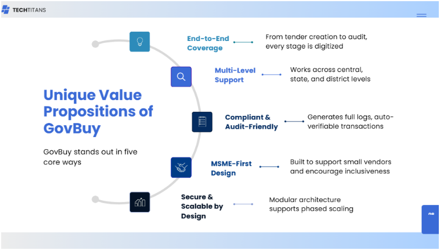
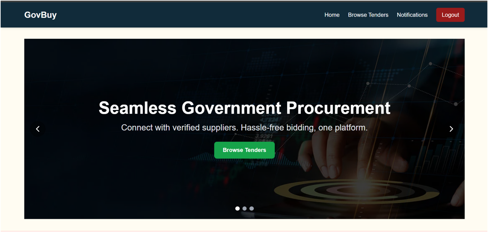
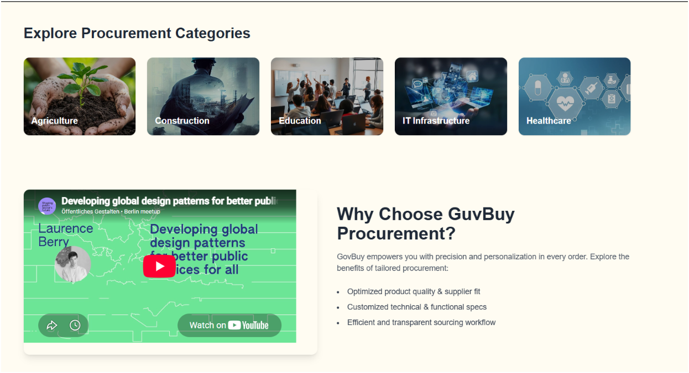
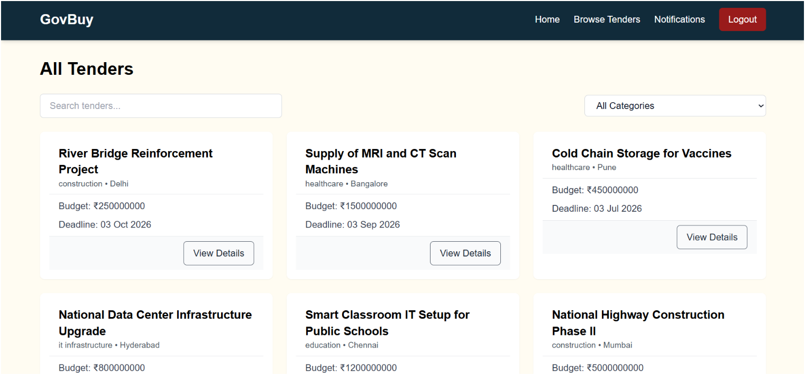
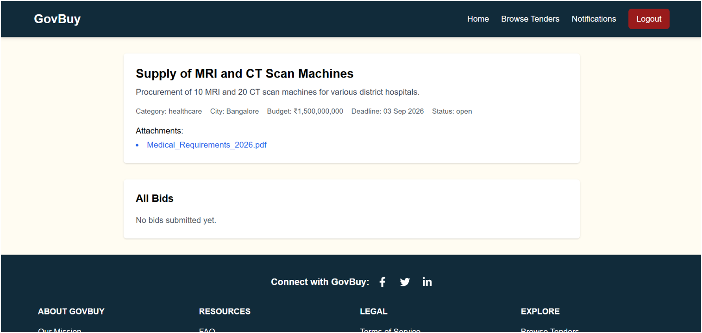
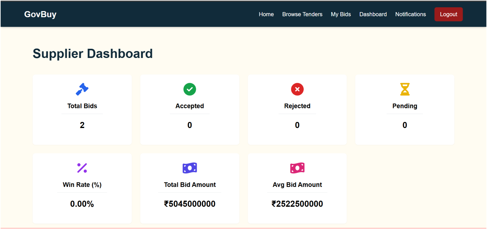
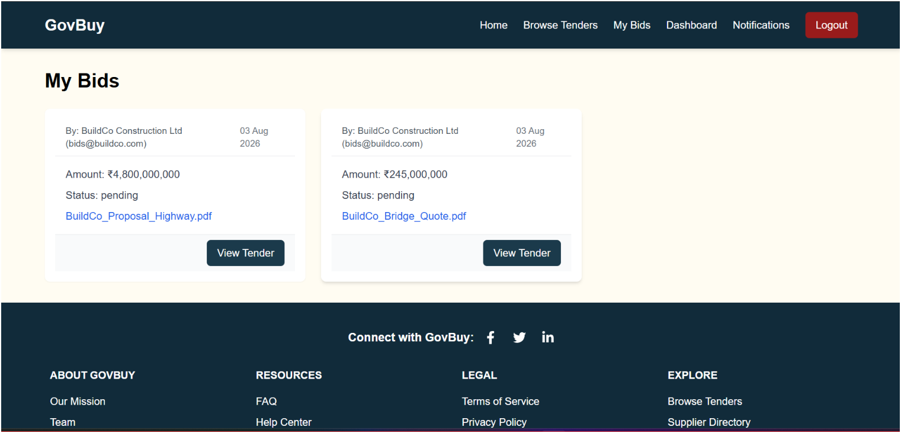
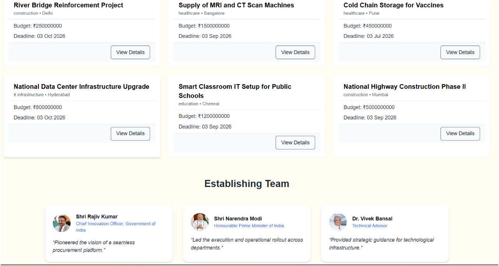
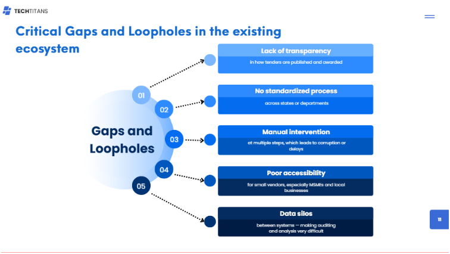

<div align="center">

# 🏛️ GovBuy — Government e-Procurement Platform

### *Unified, Transparent, and Inclusive Public Procurement Ecosystem*

[](https://www.opengroup.org/togaf)
[](https://www.opengroup.org/archimate-forum/archimate-overview)
[](https://www.opengroup.org/)
[](#-competition--recognition)


</div>

---

## 📋 Table of Contents

- [About the Project](#-about-the-project)
- [Competition & Recognition](#-competition--recognition)
- [The Problem](#-the-problem)
- [Our Solution](#-our-solution)
- [System Screenshots](#-system-screenshots)
- [Architecture & TOGAF Phases](#-architecture--togaf-phases)
- [Tech Stack](#-tech-stack)
- [Project Structure](#-project-structure)
- [Getting Started](#-getting-started)
- [Features](#-features)
- [Security](#-security)
- [Cost-Benefit Analysis](#-cost-benefit-analysis)
- [Documentation & Resources](#-documentation--resources)
- [Team & Credits](#-team--credits)
- [License](#-license)

---

## 🎯 About the Project

**GovBuy** is an enterprise-level digital procurement platform designed to modernize and streamline government procurement processes across India. The project was conceptualized, architecturally modeled using **TOGAF (The Open Group Architecture Framework)** and the **ArchiMate modeling language**, and built as a fully functional working prototype by **Team TechTitan's**.

The platform addresses critical gaps in existing government procurement systems — including fragmented workflows, lack of transparency, manual bottlenecks, and limited vendor accessibility — by providing a **unified, transparent, and inclusive** digital ecosystem.

> 🌐 **Live Demo:** [https://govbuy.vercel.app](https://govbuy.vercel.app)
>
> 📺 **Video Overview:** [Watch on YouTube](https://youtu.be/OTHmNhkz0Pg?si=GzCftl-rzSWd7JUh)

---

## 🏆 Competition & Recognition

<div align="center">

### 🌍 The Open Group — INITIATE Work Group
### **International Enterprise Architecture Competition**
### **TOGAF Enterprise Architecture — International Finalists**

</div>

This project was developed and presented as part of **The Open Group's INITIATE Work Group** — an **international-level competition** focused on **TOGAF Enterprise Architecture**. Teams from across the globe were tasked with designing enterprise architecture solutions to solve real-world problems.

**Team TechTitan's** was selected as **International Finalists**, presenting their TOGAF-aligned architecture and working prototype of GovBuy at the global stage.

The project showcases:
- **Full TOGAF ADM (Architecture Development Method)** implementation across all 8 phases
- **ArchiMate 3.2** modeling for Motivation, Business, Application, and Technology layers
- **A working MVP** that demonstrates the practical application of enterprise architecture principles
- **Comprehensive documentation** including risk matrices, cost-benefit analysis, migration planning, and governance frameworks

---

## 🔴 The Problem

Public procurement systems in India — particularly at the state and municipal levels — suffer from critical challenges:

<div align="center">

| Gap | Impact |
|---|---|
| **Lack of Transparency** | In how tenders are published and awarded |
| **No Standardized Process** | Across states or departments |
| **Manual Intervention** | At multiple steps, leading to corruption or delays |
| **Poor Accessibility** | For small vendors, especially MSMEs and local businesses |
| **Data Silos** | Between systems — making auditing and analysis very difficult |

</div>

<div align="center">

<br/>
<em>Real-world news highlighting procurement delays and challenges in India</em>
</div>

---

## ✅ Our Solution

GovBuy addresses every identified gap through a **TOGAF-aligned, ArchiMate-modeled Enterprise Architecture**:

<div align="center">

</div>

### Key Value Propositions

| Proposition | Description |
|---|---|
| **End-to-End Coverage** | From tender creation to audit, every stage is digitized |
| **Multi-Level Support** | Works across central, state, and district levels |
| **Compliant & Audit-Friendly** | Generates full logs, auto-verifiable transactions |
| **MSME-First Design** | Built to support small vendors and encourage inclusiveness |
| **Secure & Scalable by Design** | Modular architecture supports phased scaling |

### Business Impact

- ⚡ **Faster procurement cycles** due to digitized and automated workflows
- ✅ **Enhanced compliance** through real-time auditing and monitoring capabilities
- 🤝 **Increased vendor inclusivity**, opening up government contracts to SMEs
- 💰 **Cost reduction** in procurement operations via optimized resources
- 🔍 **Public trust enhancement** through transparent publishing and citizen engagement

### Anticipated Results (If Fully Deployed)

- **35–50% reduction** in procurement processing time
- **20–30% cost savings** through competitive bidding and reduced fraud
- **3× increase** in registered vendors within the first year
- **100% digitization** of procurement records with encrypted storage

---

## 📸 System Screenshots

<details>
<summary><b>🏠 Landing Page — Hero Banner & Navigation</b></summary>
<br/>

<p>The landing page features a modern hero banner with seamless navigation, showcasing the platform's primary call to action — Browse Tenders.</p>
</details>

<details>
<summary><b>📂 Explore Procurement Categories & Why GovBuy</b></summary>
<br/>

<p>Users can explore procurement categories (Agriculture, Construction, Education, IT Infrastructure, Healthcare) and learn about GovBuy's value propositions.</p>
</details>

<details>
<summary><b>📋 All Tenders — Search & Browse</b></summary>
<br/>

<p>The tender listing page with search functionality and category filtering. Displays active tenders from multiple government departments with budgets, deadlines, and quick access to details.</p>
</details>

<details>
<summary><b>📄 Tender Detail View with Bid Submission</b></summary>
<br/>

<p>Detailed view of an individual tender showing description, category, city, budget, deadline, status, and downloadable attachments. Suppliers can submit bids directly from this page.</p>
</details>

<details>
<summary><b>📊 Supplier Dashboard — Bid Analytics</b></summary>
<br/>

<p>The Supplier Dashboard provides real-time analytics: Total Bids, Accepted, Rejected, Pending counts, Win Rate, Total Bid Amount, and Average Bid Amount — all at a glance.</p>
</details>

<details>
<summary><b>📝 My Bids — Supplier Bid Tracking</b></summary>
<br/>

<p>Suppliers can track all their submitted bids, view attached proposal documents, check the status of each bid, and navigate directly to the related tender.</p>
</details>

<details>
<summary><b>🏅 Establishing Team — Leadership Carousel</b></summary>
<br/>

<p>The homepage features an establishing team section showcasing the leadership behind the initiative.</p>
</details>

---

## 🏗️ Architecture & TOGAF Phases

The architecture was designed following the complete **TOGAF ADM (Architecture Development Method)** cycle. Each phase produced specific artifacts and models using the **ArchiMate 3.2** modeling language.

<div align="center">

<br/>
<em>Identified critical gaps in the existing procurement ecosystem</em>
</div>

### TOGAF ADM Phases Covered

| Phase | Key Activities | Artifacts Produced |
|---|---|---|
| **Phase A — Architecture Vision** | Defined goals, scope, and vision | Statement of Architecture Work, Architecture Vision Diagram |
| **Phase B — Business Architecture** | Modeled key business processes & roles | Business Process Model, Actor & Role View, RACI Matrix |
| **Phase C — Information Systems Architecture** | Modeled application and data flow | Application Interaction Diagram, Data Flow View |
| **Phase D — Technology Architecture** | Defined tech components and platforms | Infrastructure Overview, Deployment View |
| **Phase E — Opportunities & Solutions** | Identified solutions and transitions | Solution Options, Migration Concepts |
| **Phase F — Migration Planning** | Sequenced implementation steps | Roadmap, Work Packages |
| **Phase G — Implementation Governance** | Oversight and standards | Implementation Guidelines, Review Checklist |
| **Phase H — Architecture Change Management** | Identified change triggers and cycles | Change Request Template, EA Governance Model |

### Architecture Layers Modeled (ArchiMate)

- **Motivation Layer** — Stakeholder goals, drivers, and requirements
- **Business Layer** — Actors, roles, processes, services, and business functions
- **Application Layer** — Application components, data objects, and service interactions
- **Technology Layer** — Infrastructure, cloud hosting, APIs, security services

> 📎 **Full ArchiMate models and diagrams:** [Google Drive](https://drive.google.com/drive/folders/1d8bCY0jqjkDudCG9K9WyUtWRbDi0hEEt?usp=sharing)

---

## 🛠️ Tech Stack

### Frontend
| Technology | Purpose |
|---|---|
| **React 19** | UI Library |
| **Vite 6** | Build Tool & Dev Server |
| **TailwindCSS 3** | Utility-First CSS Framework |
| **Redux Toolkit (RTK Query)** | State Management & API Caching |
| **React Router v7** | Client-Side Routing |
| **React Hook Form** | Form Handling & Validation |
| **Lucide React** | Icon Library |
| **Recharts** | Dashboard Charts & Analytics |
| **date-fns** | Date Formatting |

### Backend
| Technology | Purpose |
|---|---|
| **Node.js + Express** | REST API Server |
| **MongoDB + Mongoose** | Database & ODM |
| **JWT (jsonwebtoken)** | Authentication (Access + Refresh Tokens) |
| **bcrypt** | Password Hashing |
| **Helmet** | HTTP Security Headers |
| **express-rate-limit** | Rate Limiting & Brute-Force Protection |
| **express-mongo-sanitize** | NoSQL Injection Prevention |
| **xss-clean** | XSS Attack Prevention |
| **Multer** | File Upload Handling |
| **Cloudinary** | Cloud-Based File Storage |
| **Validator** | Input Validation |
| **Nodemailer** | Email Notifications |

### Architecture & Modeling Tools
| Tool | Purpose |
|---|---|
| **Archi** | ArchiMate Modeling Tool |
| **Lucidchart** | Supplementary Diagram Creation |
| **Postman** | API Testing & Documentation |

---

## 📁 Project Structure

```
GOVBUY/
├── Backend/
│   ├── src/
│   │   ├── controllers/       # Route handlers (user, tender, bid, etc.)
│   │   ├── models/            # Mongoose schemas (User, Tender, Bid, etc.)
│   │   ├── routes/            # Express route definitions
│   │   ├── middlewares/       # Auth, role-check, error handling
│   │   ├── utils/             # ApiError, ApiResponse, asyncHandler
│   │   ├── db/                # MongoDB connection
│   │   ├── app.js             # Express app configuration
│   │   └── index.js           # Server entry point
│   └── package.json
│
├── Frontend/
│   ├── src/
│   │   ├── components/        # Reusable UI components
│   │   ├── pages/             # Page-level components
│   │   ├── features/          # Redux slices & RTK Query APIs
│   │   ├── app/               # Redux store configuration
│   │   └── main.jsx           # App entry point
│   ├── public/                # Static assets
│   └── package.json
│
├── docs/
│   ├── Projectdetails/        # Full TOGAF project report (PDF + MD)
│   └── images/
│       ├── System-Images/     # Platform screenshots
│       ├── oursolution/       # Solution architecture diagrams
│       └── realissuesandnews/ # Real-world context & news clippings
│
└── README.md
```

---

## 🚀 Getting Started

### Prerequisites

- **Node.js** v18+ and **npm**
- **MongoDB** (local instance or MongoDB Atlas)
- **Git**

### Installation

1. **Clone the repository**
   ```bash
   git clone https://github.com/shaikh-aabidd/GOVBUY.git
   cd GOVBUY
   ```

2. **Setup the Backend**
   ```bash
   cd Backend
   npm install
   ```

   Create a `.env` file in the `Backend/` directory:
   ```env
   PORT=8000
   MONGODB_URI=your_mongodb_connection_string
   CORS_ORIGIN=http://localhost:5173
   ACCESS_TOKEN_SECRET=your_access_token_secret
   ACCESS_TOKEN_EXPIRY=15m
   REFRESH_TOKEN_SECRET=your_refresh_token_secret
   REFRESH_TOKEN_EXPIRY=7d
   CLOUDINARY_CLOUD_NAME=your_cloudinary_name
   CLOUDINARY_API_KEY=your_cloudinary_key
   CLOUDINARY_API_SECRET=your_cloudinary_secret
   ```

3. **Setup the Frontend**
   ```bash
   cd ../Frontend
   npm install
   ```

4. **Run the application**

   Start the Backend:
   ```bash
   cd Backend
   npm run dev
   ```

   Start the Frontend (in a new terminal):
   ```bash
   cd Frontend
   npm run dev
   ```

5. **Access the application**
   - Frontend: `http://localhost:5173`
   - Backend API: `http://localhost:8000/api/v1`

---

## ⚙️ Features

### 👤 For Citizens (Public)
- Browse all active government tenders
- Search and filter tenders by category, city, and budget
- View tender details and downloadable attachments
- Create an account to participate

### 🏢 For Suppliers
- Register as a verified supplier
- Submit bids with proposals and supporting documents
- Track all submitted bids and their status (pending, accepted, rejected)
- Supplier Dashboard with analytics: win rate, total bids, average bid amount
- Receive real-time notifications on bid updates

### 🏛️ For Government Users
- Create and publish tenders with categories, budgets, and deadlines
- Attach official tender documents
- Review and evaluate incoming bids
- Government Dashboard with procurement analytics

### 👑 For Administrators
- Full user management (approve, reject, update roles)
- Manage all tenders and bids across the platform
- Monitor system-wide procurement activity
- Admin Dashboard with comprehensive analytics

---

## 🔒 Security

GovBuy implements enterprise-grade security measures:

| Layer | Implementation |
|---|---|
| **Authentication** | JWT-based with HttpOnly secure cookies (Access + Refresh tokens) |
| **Password Security** | bcrypt hashing with salt rounds |
| **HTTP Headers** | Helmet.js for security headers (CSP, HSTS, XSS Protection) |
| **Rate Limiting** | Global rate limiter (100 req/15min) + strict auth limiter (10 req/15min) |
| **Data Sanitization** | `express-mongo-sanitize` for NoSQL injection, `xss-clean` for XSS |
| **CORS** | Dynamic origin whitelisting with credential support |
| **Input Validation** | Server-side validation using `validator.js` on all endpoints |
| **Role-Based Access** | Middleware-enforced RBAC (citizen, supplier, government, admin) |
| **Account Status Checks** | Suspended/rejected users are immediately blocked at the middleware level |

---

## 💰 Cost-Benefit Analysis

*(As documented in the TOGAF project report)*

| Cost Area | Estimated Cost (INR) | Notes |
|---|---|---|
| Platform Development | ₹1–2 lakhs | Modular, built using open-source tools |
| Cloud Hosting & Maintenance (Yearly) | ₹1–1.5 lakhs | Based on usage and storage requirements |
| Training & Onboarding | ₹2 lakhs | Procurement officers, auditors, and vendors |
| Security & Compliance | ₹1 lakh | API access controls, audit trails |
| EA Modeling and Governance | ₹1 lakh | TOGAF-aligned consulting + tools |
| **Total Estimated Cost** | **₹6–8 lakhs** | |

**Expected Benefits:** Reduction in manual errors, faster vendor response time, transparency improvement, and improved compliance during audits.

---

## 📚 Documentation & Resources

| Resource | Link |
|---|---|
| 📄 Full TOGAF Project Report | [`docs/Projectdetails/`](docs/Projectdetails/) |
| 🖼️ System Screenshots | [`docs/images/System-Images/`](docs/images/System-Images/) |
| 📊 Architecture Diagrams | [`docs/images/oursolution/`](docs/images/oursolution/) |
| 📰 Real-World Context | [`docs/images/realissuesandnews/`](docs/images/realissuesandnews/) |
| 🌐 Live Demo | [govbuy.vercel.app](https://govbuy.vercel.app) |
| 📺 YouTube Overview | [Watch Video](https://youtu.be/OTHmNhkz0Pg?si=GzCftl-rzSWd7JUh) |
| 📐 ArchiMate Models (Google Drive) | [View Models](https://drive.google.com/drive/folders/1d8bCY0jqjkDudCG9K9WyUtWRbDi0hEEt?usp=sharing) |

### References

1. The Open Group. (2018). *TOGAF® Standard, Version 9.2*. [Link](https://pubs.opengroup.org/architecture/togaf9-doc/arch/)
2. The Open Group. (2021). *ArchiMate® 3.2 Specification*. [Link](https://pubs.opengroup.org/architecture/archimate3-doc/)
3. Bernard, Scott A. (2012). *An Introduction to Enterprise Architecture.* AuthorHouse.
4. Marc Lankhorst (Ed.) (2021). *Enterprise Architecture at Work.* Springer.
5. Government of India. (2017). *Public Procurement Manual.* Ministry of Finance.
6. OECD. (2016). *Reforming Public Procurement: Progress and Challenges.*
7. World Bank. (2020). *Public Procurement Reform Good Practices.*

---

## 👥 Team & Credits

### 🏗️ Core Development

The entire web platform — frontend, backend, database architecture, API design, authentication system, and deployment — was built from the ground up by:

<table>
<tr>
<td align="center"><b>Abid Shaikh</b><br/><sub>Core Developer</sub><br/><sub>Full-Stack Development & System Architecture</sub></td>
<td align="center"><b>Farhan Sayed</b><br/><sub>Core Developer</sub><br/><sub>Full-Stack Development & System Architecture</sub></td>
</tr>
</table>

### 🏛️ TOGAF Enterprise Architecture & International Presentation

The TOGAF-level enterprise architecture design, ArchiMate modeling, documentation, and international-level presentation were accomplished by the full team:

<table>
<tr>
<td align="center"><b>Farhan Sayed</b><br/><sub>Enterprise Architecture & Presentation</sub></td>
<td align="center"><b>Simran Singh</b><br/><sub>Enterprise Architecture & Presentation</sub></td>
<td align="center"><b>Omprakash Jaat</b><br/><sub>Enterprise Architecture & Presentation</sub></td>
<td align="center"><b>Aryaa Pawar</b><br/><sub>Enterprise Architecture & Presentation</sub></td>
</tr>
</table>

#### Contributions Include:
- Research and current-state analysis of public procurement systems
- Problem identification and stakeholder assessment
- TOGAF ADM phase-wise architecture development (Phases A through H)
- ArchiMate 3.2 modeling across all four architecture layers
- Risk matrix development and mitigation strategy planning
- Cost-benefit analysis and scalability planning
- Migration roadmap and implementation governance frameworks
- Final project report preparation and documentation
- **Presentation at the international-level TOGAF Enterprise Architecture competition** organized by **The Open Group**

### Team Name: **TechTitan's**

> *"Throughout the journey, we collaborated closely on all stages — from research and architectural modeling to system design and documentation — ensuring the project's successful completion with commitment, creativity, and a passion for innovation."*

---

## 📄 License

This project was developed as part of an academic and competitive initiative under **The Open Group's INITIATE Work Group**. All rights reserved by Team TechTitan's.

---

<div align="center">

**Built with ❤️ by Team TechTitan's**

*Conceptualized, Architected, and Developed for The Open Group — INITIATE Work Group International Competition*

[](https://govbuy.vercel.app)
[](https://youtu.be/OTHmNhkz0Pg?si=GzCftl-rzSWd7JUh)

</div>
